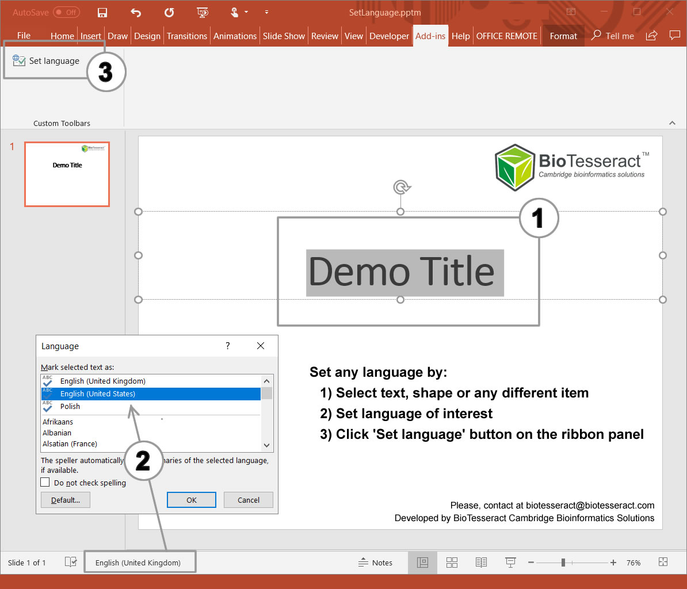

# SetLanguage PowerPoint Add-in

This Add-In sets appropriate language to all elements (shapes, text, boxes etc.) in PowerPoint presentation even if the default set language command doesn't work it properly

# How to add / install PowerPoint Add-in

If you download an add-in or if a co-worker or friend sends you an add-in, you can save it to your computer and then install the add-in by adding it to the Available Add-Ins list.

  1. Click File > Options, and then click Add-Ins.
  2. In the Manage list, click PowerPoint Add-ins, and then click Go.
  3. In the Add-Ins dialog box, click Add New.
  4. In the Add New PowerPoint Add-In dialog box, browse for the add-in that you want to add, and then click OK.
  5. A security notice appears. If you are certain that the add-in comes from a trusted source, click Enable Macros, and then click Close.
